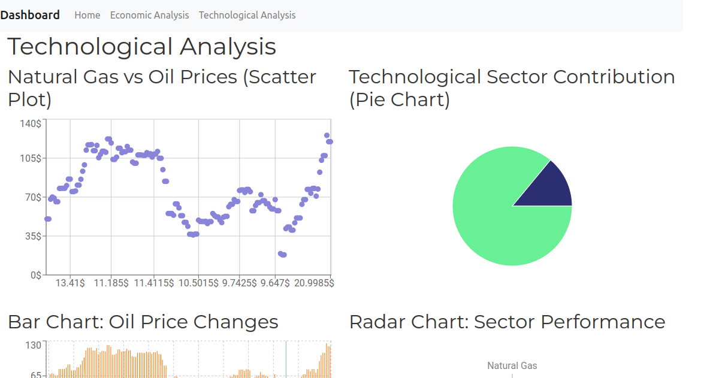

# Brent Oil Price Change Point Analysis

This project focuses on change point analysis and statistical modeling of time series data to investigate the impact of various economic, financial, and technological factors on Brent oil prices. By leveraging historical data and integrating diverse indicators, the project aims to deliver insights into how external factors may affect oil price fluctuations over time.

## Table of Contents

- [Project Overview](#project-overview)
- [Features](#features)
- [Dataset](#dataset)
- [Data Preparation](#data-preparation)
- [Architecture](#architecture)
- [Installation](#installation)
- [Usage](#usage)
- [API Endpoints](#api-endpoints)
- [Deployment](#deployment)
- [Deployed Sites](#deployed-site)

## Project Overview

This project uses statistical modeling and change point analysis to study Brent oil price data from April 2002 to September 2022. The application consists of a **backend** (using Flask) that provides API endpoints for data retrieval and filtering, and a **frontend** (built with Vite) that visualizes the data in an interactive dashboard.

## Features

- **Change Point Detection**: Identifies structural changes in Brent oil price trends.
- **Economic and Financial Data Integration**: Enriches analysis with additional indicators like unemployment rates, inflation, GDP, and exchange rates.
- **API for Data Retrieval**: Provides filtered and paginated access to economic and technological data.
- **Interactive Frontend Dashboard**: Enables visualization and exploration of Brent oil price trends and related factors.

## Dataset

The primary dataset includes historical Brent oil prices with dates from April 2002 to September 2022. Additional datasets incorporated are:

- **Economic Data**: Unemployment rates, GDP, inflation, and currency exchange rates.
- **Technological Data**: Relevant technological trends that could influence market behavior.

## Data Preparation

1. **Data Collection**: Brent oil price data was downloaded and combined with other datasets.
2. **Cleaning and Formatting**: Dates were parsed, missing values addressed, and columns formatted for consistency.
3. **Merging**: Economic indicators and technological data were appended to create a unified dataset.
4. **Change Point Detection**: Analysis methods were applied to identify significant changes in trends over time.

## Architecture

The project is split into a **backend** and a **frontend**:

- **Backend**: Built with Flask, providing RESTful API endpoints for data access and filtering. Utilizes caching and compression for performance optimization.
- **Frontend**: Developed with Vite, serving as an interactive dashboard for users to visualize data trends and change points.

---

## Installation

1. Clone the repository:

    ```bash
    git clone https://github.com/your-username/brent-oil-analysis.git
    cd brent-oil-analysis
    ```

### Backend Setup

2. Navigate to the `backend` folder:

    ```bash
    cd src/flask_backend
    ```

3. Install required packages:

    ```bash
    pip install -r requirements.txt
    ```

4. Run the backend server locally:

    ```bash
    gunicorn --bind 0.0.0.0:5000 app:app
    ```

### Frontend Setup

5. Install frontend dependencies:

    ```bash
    cd src/oil_price_forecast
    npm install
    ```

6. Build the frontend for production:

    ```bash
    npm run build
    ```

7. Serve the frontend locally:

    ```bash
    npm run dev
    ```

---

## Usage

- Start the backend server at [http://localhost:5000](http://localhost:5000).
- Access the frontend dashboard at [http://localhost:3000](http://localhost:3000) (when running in development mode) or via the production build.

## API Endpoints

### Economic Data API

- **Endpoint**: `/api/econ_data`
- **Method**: GET
- **Parameters**:
  - `start_date` (optional): Filter records after this date.
  - `end_date` (optional): Filter records before this date.
  - `page` (optional): Pagination, default is `1`.
  - `limit` (optional): Number of records per page, default is `100`.
- **Description**: Retrieves paginated and filtered economic data based on the specified date range.

### Technological Data API

- **Endpoint**: `/api/tech_data`
- **Method**: GET
- **Description**: Returns all records from the technological data.

## Deployment

### Backend Docker Deployment

1. Create a Docker image for the backend:

    ```bash
    sudo docker build -t backend-brent-oil .
    ```

2. Run the Docker container:

    ```bash
    sudo docker run -p 5000:5000 backend-brent-oil
    ```

3. (Optional) Tag and push to Docker Hub:

    ```bash
    sudo docker tag backend-brent-oil yourdockerhubusername/backend-brent-oil
    sudo docker push yourdockerhubusername/backend-brent-oil
    ```

### Frontend Docker Deployment

1. Create a Docker image for the frontend:

    ```bash
    sudo docker build -t frontend-brent-oil .
    ```

2. Run the Docker container:

    ```bash
    sudo docker run -p 80:80 frontend-brent-oil
    ```

3. (Optional) Tag and push to Docker Hub:

    ```bash
    sudo docker tag frontend-brent-oil yourdockerhubusername/frontend-brent-oil
    sudo docker push yourdockerhubusername/frontend-brent-oil
    ```

### Dockerfile for Backend

```Dockerfile
FROM python:3.8-slim

WORKDIR /app

COPY . .

RUN pip install --no-cache-dir -r requirements.txt

EXPOSE 5000

CMD ["gunicorn", "--bind", "0.0.0.0:5000", "app:app"]
```

### Deployed Site
The project is deployed and accessible at: [Deployed URL](https://frontend-brent-oil-latest.onrender.com/)

You can access the interactive dashboard and explore the Brent oil price data along with additional economic indicators at this URL. The site includes visualizations, filters, and detailed analysis for a comprehensive view of the data.

### Screenshot

